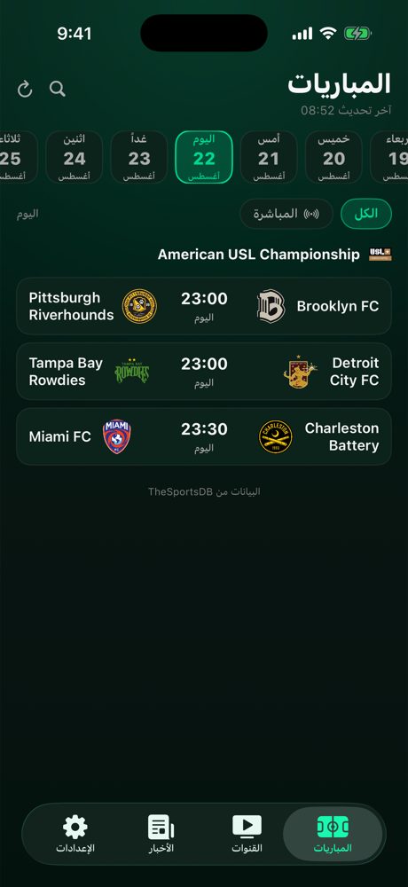
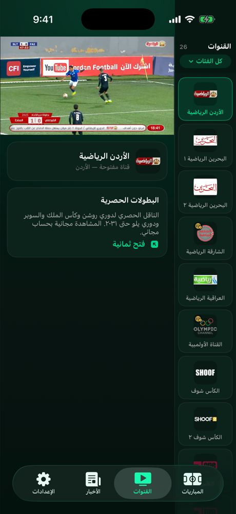
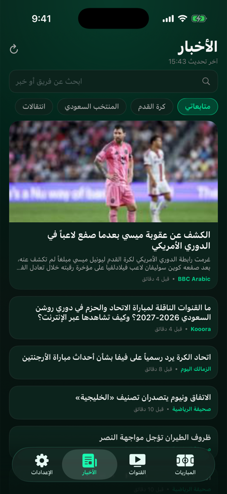
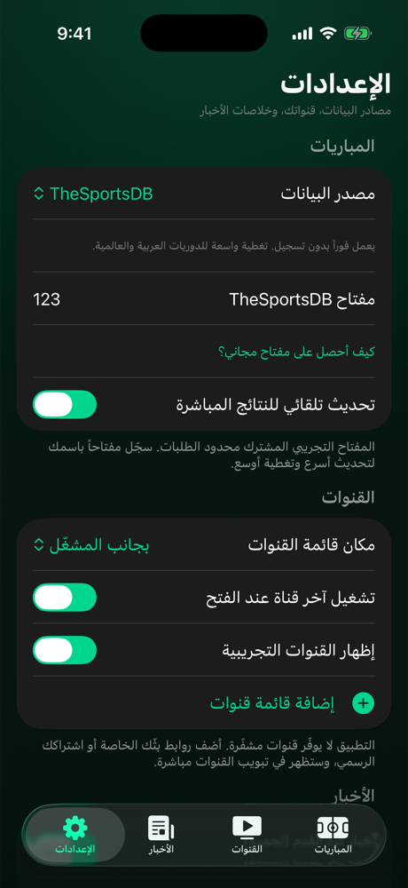
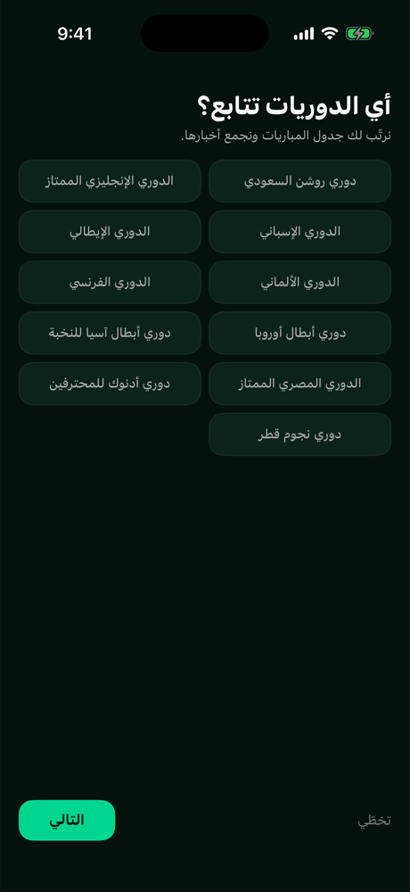

# كورة تايم — تطبيق آيفون

تطبيق كرة قدم عربي بواجهة SwiftUI: **المباريات**، **القنوات**، **الأخبار**، **الإعدادات**.
التطبيق كامل الاتجاه من اليمين لليسار، بتقويم ميلادي وأسماء عربية للفرق والبطولات.

> يوجد أيضاً [**تطبيق أندرويد أصيل**](../KoraTimeAndroid/README.md) بنفس التبويبات
> والألوان، ويشارك هذا المشروع ملفَّي القنوات وتعريب الأسماء.

---

## من داخل التطبيق

لقطات حقيقية من محاكي آيفون، تُلتقط آلياً مع كل بناء عبر
[التشغيل الآلي](../.github/workflows/ios.yml) — لا تصاميم تخيّلية.

| المباريات | القنوات |
|---|---|
|  |  |

| الأخبار | الإعدادات |
|---|---|
|  |  |

| أول تشغيل |
|---|
|  |

**تجربة التطبيق بلا ماك:** حمّل
[نسخة المحاكي](https://github.com/a7m2030ed-debug/Aogh/releases/download/sim-build/KoraTime-simulator.zip)
وارفعها على [appetize.io](https://appetize.io) لتشغيل التطبيق داخل المتصفّح على أي جهاز.

---

## التشغيل

يلزم جهاز **Mac** عليه **Xcode 15 أو أحدث** (الهدف iOS 17+):

```bash
open KoraTime/KoraTime.xcodeproj
```

ثم اختر أي محاكي آيفون واضغط ▶︎. لا توجد أي حزم خارجية — يفتح ويبني مباشرة.

للتشغيل على جهازك الحقيقي: من `Signing & Capabilities` اختر حسابك في `Team`،
وغيّر `Bundle Identifier` إلى شيء خاص بك (مثل `com.yourname.koratime`).
حساب Apple المجاني يكفي لتجربة سبعة أيام على الجهاز.

> إن أضفت ملفات جديدة إلى مجلد `KoraTime/`، أعد توليد المشروع:
> `python3 Tools/make_xcodeproj.py`

---

## النشر على App Store (بلا ماك)

[إجراء النشر](../.github/workflows/ios-release.yml) يبني نسخة موقّعة على خادم
ماك ويرفعها إلى App Store Connect. يُشغَّل بيدك من تبويب **Actions** ← «نشر
كورة تايم على App Store Connect» ← **Run workflow**.

**قبل أول تشغيل** يلزم اشتراك [Apple Developer Program](https://developer.apple.com/programs/)،
ثم أربعة أسرار تُضاف من `Settings ← Secrets and variables ← Actions ← New repository secret`:

| السرّ | من أين |
|---|---|
| `APP_STORE_CONNECT_ISSUER_ID` | App Store Connect ← Users and Access ← Integrations ← Keys |
| `APP_STORE_CONNECT_KEY_ID` | رقم المفتاح في الصفحة نفسها |
| `APP_STORE_CONNECT_PRIVATE_KEY` | محتوى ملف `.p8` كاملاً بما فيه سطرا `BEGIN` و`END` |
| `APPLE_TEAM_ID` | developer.apple.com ← Membership |

> هذه مفاتيح حسابك: تُلصق في صفحة الأسرار مباشرة، ولا تُرسل في أي محادثة
> ولا تُكتب في أي ملف داخل المستودع. الإجراء يمحو المفتاح من الخادم بعد
> كل تشغيل، ناجحاً كان أو فاشلاً.

عند إنشاء المفتاح اختر صلاحية **App Manager** أو **Admin**: الأقلّ منهما لا
يسمح بإنشاء شهادة التوزيع تلقائياً، فيتوقّف البناء عند التوقيع.

ويلزم كذلك إنشاء سجلّ التطبيق في App Store Connect بمعرّف الحزمة
`com.koratime.app` (أو غيّره في `Tools/make_xcodeproj.py` ثم أعد التوليد).

التوقيع تلقائي: `-allowProvisioningUpdates` يُنشئ شهادة التوزيع وملف التهيئة
عند أول تشغيل. رقم البناء يأخذ رقم تشغيل الإجراء فيزيد وحده مع كل رفع.
بعد الرفع تظهر النسخة في TestFlight خلال ٥–٣٠ دقيقة، ومنها تُرسل للمراجعة.

بيان الخصوصية `Resources/PrivacyInfo.xcprivacy` مرفق: التطبيق لا يجمع شيئاً
ولا يتتبّع، ويعلن سبب استعمال `UserDefaults` كما تطلب آبل.

---

## التبويبات

### المباريات
شريط أيام (من ٤ أيام مضت إلى ١٠ قادمة)، والمباريات مجمّعة تحت بطولاتها،
البطولة التي فيها مباراة جارية تُرفع لأعلى القائمة. لكل مباراة: الشعارات،
النتيجة أو وقت البداية، ودقيقة اللعب للمباريات المباشرة (تتحدّث كل دقيقة تلقائياً).
البحث يغطّي أسماء الفرق والبطولات، وزر «المباشرة» يعرض الجارية فقط.
فتح أي مباراة يعطيك لوحة نتيجة كاملة مع الملعب والجولة وعدّاد تنازلي،
وزرّين: مشاهدة على القنوات، وأخبار المباراة.

الترتيب: **دورياتك المختارة** أولاً، ثم الدوريات الكبرى وروشن، ثم ما فيه
مباراة جارية، ثم الاسم. أول تشغيل يسألك عن دورياتك وفرقك، وتُعدَّل لاحقاً
من الإعدادات.

**مصدر البيانات** يُختار من الإعدادات:

| المصدر | التسجيل | ملاحظات |
|---|---|---|
| [API-Football](https://dashboard.api-football.com/register) (**موصى به**) | مفتاح مجاني | المصدر الوحيد المجاني الذي يغطّي **دوري روشن والدوريات الكبرى معاً**. ضع المفتاح في الإعدادات ويصير المصدر الأول تلقائياً. |
| [TheSportsDB](https://www.thesportsdb.com/free_sports_api) (الافتراضي بلا مفتاح) | لا يلزم | مفتاحه التجريبي المشترك يُرجع ثلاث مباريات يومياً من دوريات هامشية — بلا روشن وبلا الكبرى ([القياس](../docs/matches-report.md)). |
| [football-data.org](https://www.football-data.org/client/register) | مفتاح مجاني | الدوريات الأوروبية الكبرى دون الدوري السعودي. |

من وضع مفتاح API-Football يُسأل أولاً، وإن لم يُرجع شيئاً لليوم المطلوب
يُسأل المصدر القديم قبل إظهار شاشة فارغة.

### القنوات
يفتح التبويب فيبدأ البثّ فوراً (آخر قناة شاهدتها)، وقائمة القنوات على اليمين
بجانب المشغّل — نفس طريقة تطبيقات البث. الضغط على أي قناة يبدّل البث في مكانه
بلا انتقال لشاشة أخرى.

* أفقياً: المشغّل يملأ الشاشة والقائمة تبقى جانبه، مع زر لطيّها.
* عمودياً: تختار من الإعدادات — القائمة **بجانب المشغّل** (الافتراضي) أو **تحته**.
* أزرار: تشغيل/إيقاف، كتم، نسبة العرض، **عكس البثّ على التلفاز**، طيّ القائمة،
  ملء الشاشة. في ملء الشاشة يدور الجهاز عرضياً وتختفي الأزرار وحدها، ولمسة
  واحدة على الصورة تُعيدها.
* **عكس البثّ على الشاشات الذكية** عبر AirPlay: النظام يكتشف Apple TV وأجهزة
  التلفاز التي تدعم AirPlay 2 (سامسونج، إل جي، سوني الحديثة) ويعرضها في قائمته.
* تحت المشغّل: بطاقة القناة الحالية فقط — لا جدول مباريات.
* الصوت يكمل في الخلفية، وعند تعثّر البث تظهر رسالة واضحة مع زر إعادة المحاولة.

**زمن البدء.** قناة البداية تُحضَّر مع إقلاع التطبيق (بلا صوت) فتفتح عند دخول
التبويب بلا انتظار، والمخزن قصير، ومعدّل البِتّ مسقوف في الثواني الأولى فيبدأ
المشغّل بنسخة خفيفة ثم يرتقي.

**من أين تأتي القنوات.** التطبيق لا يفكّ تشفير أي بثّ. القنوات المدفوعة
(بي إن سبورت، SSC، شاهد، TOD) محمية بـ DRM ولا تعمل في أي مشغّل خارج تطبيقاتها
الرسمية — لا يوجد لها رابط M3U، وما يُنشر منها على الإنترنت إعادة بثّ مقرصنة
لا نضيفها.

ما يأتي مع التطبيق هو قنوات **مفتوحة** فقط، وتُبنى قائمتها آلياً:
[`discover_channels.py`](../.github/scripts/discover_channels.py) يجلب العناوين
الحالية من فهرس iptv-org المفتوح، ثم
[`verify_channels.py`](../.github/scripts/verify_channels.py) يجرّب كل رابط —
يفتح قائمة الـ HLS وينزل لأول جودة ليتأكّد من وجود مقاطع حيّة — ولا يدخل
التطبيق إلا ما نجح. يعاد الفحص كل أسبوع فتُحذف الروابط الميتة تلقائياً.
كون الرابط مفتوحاً لا يضمن أنه بثّ رسمي مرخّص، فراجع ما يهمّك منها.

ويمكنك دائماً إضافة قائمتك الخاصة من الإعدادات:

* **M3U / M3U8** — يقرأ `tvg-logo` و`group-title` وترويسات `User-Agent` و`Referer`
  سواء عبر `#EXTVLCOPT` أو الملحقة بالرابط بعد `|`.
* **JSON** — مصفوفة بالشكل:

```json
[
  { "name": "اسم القناة", "group": "الفئة", "logo": "https://…/logo.png", "url": "https://…/index.m3u8" }
]
```

القوائم تبقى على جهازك ولا تُرسل لأي خادم.

### الأخبار
تجميع من عدّة خلاصات RSS في وقت واحد، مع إزالة المكرّر وترتيب بالأحدث،
وأول خبر ببطاقة كبيرة. البحث وأزرار المواضيع (الهلال، النصر، دوري روشن،
دوري الأبطال، الانتقالات…) تجلب نتائج فورية. الخبر يُفتح داخل التطبيق بوضع القراءة.

الخلاصات الافتراضية: أخبار Google بالعربية (تجمع يلا كورة وكووورة وفلجول وغيرها)
+ BBC عربي رياضة + سكاي نيوز عربية. تقدر تطفئ أياً منها أو تضيف رابط RSS لأي موقع.

### الإعدادات
**اللغة** (العربية افتراضاً، والإنجليزية بلمسة — تغييرها يعيد بناء الشاشة
ويقلب الاتجاه)، **تفضيلاتي** (تعديل الدوريات والفرق)، مفتاح API-Football
ومصدر المباريات ومفاتيحه، التحديث التلقائي، مكان قائمة القنوات، التشغيل
التلقائي، قوائم القنوات، خلاصات الأخبار، وتعريب أسماء الفرق.

نصوص الواجهة **مولَّدة من موارد أندرويد نفسها** عبر
[`Tools/make_localization.py`](Tools/make_localization.py)، فلا تفترق ترجمة
التطبيقين — ويفشل [التشغيل الآلي](../.github/workflows/ios.yml) إن نُسي التوليد.

---

## البنية

```
KoraTime/
├── KoraTime.xcodeproj/          مشروع Xcode (مولَّد من Tools/make_xcodeproj.py)
├── KoraTime/
│   ├── App/                     نقطة الدخول، شريط التبويبات، التنقّل بين الشاشات
│   ├── Core/                    الإعدادات، الشبكة، التواريخ، النصوص، كتالوج الدوريات
│   ├── Design/                  الألوان، الصور المخزّنة، عناصر واجهة مشتركة
│   ├── Features/
│   │   ├── Matches/             النماذج، مزوّدو البيانات، الشاشات
│   │   ├── Channels/            المشغّل، AirPlay، قارئ M3U، شاشة القنوات
│   │   ├── News/                قارئ RSS/Atom، شاشة الأخبار
│   │   ├── Onboarding/          شاشة أول تشغيل: الدوريات ثم الفرق
│   │   └── Settings/            شاشة الإعدادات
│   ├── Resources/               channels.json, ar-names.json, Assets
│   └── Info.plist
├── Tools/
│   ├── make_xcodeproj.py        توليد ملف المشروع
│   ├── make_localization.py     توليد جدول النصوص من موارد أندرويد
│   └── make_appicon.py          توليد أيقونة التطبيق
└── project.yml                  بديل XcodeGen (اختياري)
```

بلا أي اعتمادات خارجية: `SwiftUI` + `AVFoundation` + `AVKit` + `SafariServices`
+ `XMLParser` فقط.

## ملاحظات تقنية

* الحد الأدنى iOS 17 (لاستخدام `@Observable`).
* `NSAllowsArbitraryLoads` مفعّل لأن كثيراً من روابط البث تعمل على HTTP؛
  إن كانت كل روابطك HTTPS فبإمكانك حذفه من `Info.plist`.
* الصور والطلبات تُخزَّن مؤقتاً على القرص لتقليل الاستهلاك، ونتائج اليوم
  تُعاد قراءتها من الشبكة كل ٤٥ ثانية كحد أقصى.
* أسماء الفرق والبطولات العربية في `Resources/ar-names.json` — أضف ما ينقصك هناك.
